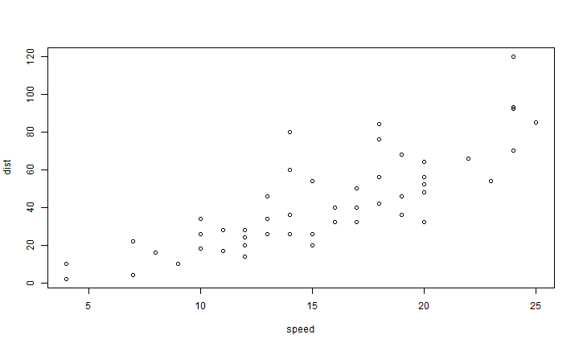

# Dixon-Coles 1996 Model

This model is the basic/flat model without decay rate and also prediction for future match. However we can know the concept, theory and the algorithmic EM model. <https://github.com/englianhu/Dixon-Coles1996>

Scrap the data from the English Premier League season 2013/14 official website

```r
library(shiny)
library(shinyapps)
library(devtools)
library(fbRanks)
library(XML)
library(plyr)
library(dplyr)

# get the English Premier League 2013/2014 from official website
url = getURL("http://www.premierleague.com/en-gb/matchday/results.html?paramClubId=ALL&paramComp_8=true&paramSeason=2013-2014&view=.scoresSeason")
tbl <- readHTMLTable(htmlParse(url), header = "text")
tbl[[length(tbl)]] <- NULL
tbl <- lapply(tbl, function(x) {
    x$V1 = x$V1[1]
    x[-1, ]
})
scores <- Reduce(function(x, y) merge(x, y, all = T), tbl, accumulate = F)[1:5]
scores$HG <- as.numeric(unlist(lapply(str_split(as.character(scores$V3), "-"), 
    function(x) x[1])))
scores$AG <- as.numeric(unlist(lapply(str_split(as.character(scores$V3), "-"), 
    function(x) x[2])))
scores$V3 <- NULL
names(scores) <- c("date", "home.team", "away.team", "venue", "home.score", 
    "away.score")
scores$date <- unlist(lapply(str_split(scores$date, " "), function(x) paste(x[-1], 
    collapse = "")))
scores$date <- as.Date(scores$date, "%d%B%Y")
attr(scores$home.team, "levels") <- levels(factor(scores$home.team))
attr(scores$away.team, "levels") <- levels(factor(scores$away.team))
scores$venue <- as.character(scores$venue)
teams <- scores[order(scores$date, decreasing = T) & !duplicated(scores$venue), 
    ][c("home.team", "venue")]
names(teams)[1] <- "name"
scores$hdv <- ifelse(scores$home.team == teams$name & scores$venue == teams$venue, 
    1, 0)  # scoresa error:only 33 matches home ground among 380 matches
# match(scores$home.team,teams$name) match(scores$venue,teams$venue)
rm(url, tbl, teams)
save(scores, file = "scores.Rda")
write.csv(scores, "scores.csv")
```

Load data and simulate the result

```r
library(shiny)
library(shinyapps)
library(devtools)
library(fbRanks)
library(XML)
library(plyr)
library(dplyr)

# Load soccer matches scoresa
load("~/scores.Rda")
# scores <- read.csv('scores.csv')
scores <- create.fbRanks.dataframes("scores.csv")
```

```
Alert: teams info file was not passed in.
Will construct one from the scores data frame but teams in the scores file must use a unique name.
Alert: teams resolver was not passed in.
Will construct one from the team info data frame.
```

```r
teams <- scores$scores[order(scores$scores$date, decreasing = T) & !duplicated(scores$scores$venue), 
    ][c("home.team", "venue")]
names(teams)[1] <- "name"

# Dixon & Coles poisson model, we can also add some more effect like
# weather, pitch condition, home ground advantages etc.
md1 <- rank.teams(scores$scores, min.date = min(scores$scores$date), max.date = max(scores$scores$date), 
    silent = T)  #without other effects
md2 <- rank.teams(scores$scores, min.date = min(scores$scores$date), max.date = max(scores$scores$date), 
    silent = T)  #with home team advantage
md3 <- rank.teams(scores$scores, min.date = min(scores$scores$date), max.date = max(scores$scores$date), 
    silent = T, add = "venue")  #with venue effects

# -------------------------------------------------------------------------------
# model 1 measure the team attack and defence index.
md1.att <- coef(md1$fit$cluster.1)[1:nrow(md1$teams)]
md1.def <- coef(md1$fit$cluster.1)[-seq(1, nrow(md1$teams))]
md1.tbl <- data.frame(coef(md1))[c(1:nrow(scores$teams)), -1]
names(md1.tbl) <- c("attack", "defence")
md1.tbl <- data.frame(team = sort(as.character(teams$name)), md1.tbl)
md1.tbl$attack <- exp(md1.tbl$attack)
md1.tbl$defence <- exp(md1.tbl$defence)
row.names(md1.tbl) <- NULL
md1.hm <- ddply(scores$scores, "home.team", summarise, scores = sum(home.score), 
    mean = mean(home.score), sd = sd(home.score), se = sd/sqrt(nrow(scores$scores)))
md1.aw <- ddply(scores$scores, "away.team", summarise, scores = sum(away.score), 
    mean = mean(away.score), sd = sd(away.score), se = sd/sqrt(nrow(scores$scores)))

# model 2 measure the team attack, defence and home ground advantage index.
md2.att <- coef(md2$fit$cluster.1)[1:nrow(md2$teams)]
md2.def <- coef(md2$fit$cluster.1)[seq(nrow(md2$teams) + 2, nrow(md2$teams) * 
    2) - 1]
md2.hdv <- coef(md2$fit$cluster.1)[-seq(nrow(md2$teams) * 2) + 1]
md2.tbl <- data.frame(coef(md2)$coef.list)
names(md2.tbl) <- c("attack", "defence", "hdv")
```

```
Error in names(md2.tbl) <- c("attack", "defence", "hdv"): 'names' attribute [3] must be the same length as the vector [2]
```

```r
md2.tbl <- data.frame(team = sort(as.character(teams$name)), md2.tbl)
md2.tbl$attack <- exp(md2.tbl$attack)
```

```
Error in exp(md2.tbl$attack): non-numeric argument to mathematical function
```

```r
md2.tbl$defence <- exp(md2.tbl$defence)
```

```
Error in exp(md2.tbl$defence): non-numeric argument to mathematical function
```

```r
row.names(md2.tbl) <- NULL
md2.hm <- ddply(scores$scores, "home.team", summarise, scores = sum(home.score), 
    mean = mean(home.score), sd = sd(home.score), se = sd/sqrt(nrow(scores$scores)))
md2.aw <- ddply(scores$scores, "away.team", summarise, scores = sum(away.score), 
    mean = mean(away.score), sd = sd(away.score), se = sd/sqrt(nrow(scores$scores)))

# model 3 measure the team attack, defence and venue index.
md3.att <- coef(md3$fit$cluster.1)[1:nrow(md3$teams)]
md3.def <- coef(md3$fit$cluster.1)[seq(nrow(md3$teams) + 2, nrow(md3$teams) * 
    2) - 1]
md3.hdv <- coef(md3$fit$cluster.1)[-seq(nrow(md3$teams) * 2) + 1]
md3.tbl <- data.frame(coef(md3))[c(1:nrow(scores$teams)), -1]
names(md3.tbl) <- c("attack", "defence")
md3.tbl <- data.frame(team = sort(as.character(teams$name)), md3.tbl)
md3.tbl$attack <- exp(md3.tbl$attack)
md3.tbl$defence <- exp(md3.tbl$defence)
row.names(md3.tbl) <- NULL
md3.hm <- ddply(scores$scores, "home.team", summarise, scores = sum(home.score), 
    mean = mean(home.score), sd = sd(home.score), se = sd/sqrt(nrow(scores$scores)))
md3.aw <- ddply(scores$scores, "away.team", summarise, scores = sum(away.score), 
    mean = mean(away.score), sd = sd(away.score), se = sd/sqrt(nrow(scores$scores)))
```

Simulate the venue (home ground advantage and neutral ground), and predict a specific kick-off scores

```r
# Simulate model 1 Example : predict a match kick-off on last match-day
sim1 <- simulate(md1)
```

```

               1st 2nd 3rd 4th 5th 6th 7th 8th 9th 10th 11th 12th 13th 14th 15th 16th 17th 18th 19th 20th
Liverpool       18  38  30  10   3   1   0   0   0    0    0    0    0    0    0    0    0    0    0    0
Norwich          0   0   0   0   0   0   0   0   0    0    0    1    1    2    4    6   11   19   26   29
Sunderland       0   0   0   0   0   0   1   2   4    6    8   10   11   12   12   12   10    7    4    2
West Brom        0   0   0   0   0   0   1   3   6    9   10   12   12   12   11    9    7    5    2    1
Arsenal          1   5  13  30  24  15   7   3   1    0    0    0    0    0    0    0    0    0    0    0
Swansea          0   0   0   1   3   7  14  18  18   13    9    6    4    3    2    1    1    0    0    0
West Ham         0   0   0   0   0   1   2   5   8   11   12   12   12   11    9    8    6    3    2    1
Crystal Palace   0   0   0   0   0   0   1   1   3    5    7    9   11   12   12   13   11    8    5    2
Chelsea         13  32  35  13   5   2   0   0   0    0    0    0    0    0    0    0    0    0    0    0
Man City        67  22   8   2   0   0   0   0   0    0    0    0    0    0    0    0    0    0    0    0
Fulham           0   0   0   0   0   0   0   0   0    0    1    1    2    3    5    8   13   20   24   23
Hull             0   0   0   0   0   0   1   2   4    7    9   11   12   12   12   11    9    6    3    1
Southampton      0   0   1   3   8  15  22  19  13    8    5    3    2    1    1    0    0    0    0    0
Aston Villa      0   0   0   0   0   0   0   1   2    4    6    8    9   11   13   13   13   10    6    3
Everton          0   2   7  20  25  22  12   6   3    1    0    0    0    0    0    0    0    0    0    0
Newcastle        0   0   0   0   0   0   1   3   6    9   10   12   12   11   11    9    7    5    2    1
Stoke            0   0   0   0   1   2   5   9  13   15   14   11    9    7    5    4    3    1    1    0
Cardiff          0   0   0   0   0   0   0   0   0    0    0    1    1    2    3    5    9   16   26   37
Spurs            0   0   0   2   5  11  18  20  16   10    7    4    3    2    1    1    0    0    0    0
Man Utd          0   2   6  19  25  23  13   7   3    1    1    0    0    0    0    0    0    0    0    0
```

```r
predict(md1, date = as.Date(max(scores$scores$date)))
```

```
Predicted Match Results for 1900-05-01 to 2100-06-01
Model based on data from 2013-08-17 to 2014-05-11
---------------------------------------------
2014-05-11 Cardiff vs Chelsea, HW 5%, AW 83%, T 13%, pred score 0.4-2.5  actual: AW (1-2)
2014-05-11 Fulham vs Crystal Palace, HW 27%, AW 46%, T 27%, pred score 1-1.4  actual: T (2-2)
2014-05-11 Hull vs Everton, HW 18%, AW 57%, T 25%, pred score 0.7-1.6  actual: AW (0-2)
2014-05-11 Liverpool vs Newcastle, HW 74%, AW 11%, T 14%, pred score 3-1.1  actual: HW (2-1)
2014-05-11 Man City vs West Ham, HW 75%, AW 9%, T 15%, pred score 2.5-0.8  actual: HW (2-0)
2014-05-11 Norwich vs Arsenal, HW 10%, AW 72%, T 19%, pred score 0.6-2  actual: AW (0-2)
2014-05-11 Southampton vs Man Utd, HW 30%, AW 44%, T 26%, pred score 1.2-1.5  actual: T (1-1)
2014-05-11 Spurs vs Aston Villa, HW 53%, AW 23%, T 24%, pred score 1.7-1  actual: HW (3-0)
2014-05-11 Sunderland vs Swansea, HW 26%, AW 49%, T 25%, pred score 1.1-1.6  actual: AW (1-3)
2014-05-11 West Brom vs Stoke, HW 32%, AW 41%, T 27%, pred score 1.1-1.3  actual: AW (1-2)
```

```r
pr1 <- predict(md1)
```

```
Predicted Match Results for 1900-05-01 to 2100-06-01
Model based on data from 2013-08-17 to 2014-05-11
---------------------------------------------
2013-08-17 Liverpool vs Stoke, HW 68%, AW 15%, T 17%, pred score 2.6-1.2  actual: HW (1-0)
2013-08-17 Norwich vs Everton, HW 11%, AW 68%, T 21%, pred score 0.6-1.8  actual: T (2-2)
2013-08-17 Sunderland vs Fulham, HW 49%, AW 27%, T 24%, pred score 1.7-1.2  actual: AW (0-1)
2013-08-17 West Brom vs Southampton, HW 24%, AW 51%, T 25%, pred score 1-1.6  actual: AW (0-1)
2013-08-17 Arsenal vs Aston Villa, HW 66%, AW 14%, T 20%, pred score 2-0.8  actual: AW (1-3)
2013-08-17 Swansea vs Man Utd, HW 26%, AW 50%, T 24%, pred score 1.2-1.7  actual: AW (1-4)
2013-08-17 West Ham vs Cardiff, HW 52%, AW 21%, T 27%, pred score 1.5-0.8  actual: HW (2-0)
2013-08-18 Crystal Palace vs Spurs, HW 24%, AW 47%, T 29%, pred score 0.8-1.3  actual: AW (0-1)
2013-08-18 Chelsea vs Hull, HW 69%, AW 10%, T 21%, pred score 1.8-0.5  actual: HW (2-0)
2013-08-19 Man City vs Newcastle, HW 80%, AW 8%, T 12%, pred score 3-0.8  actual: HW (4-0)
2013-08-21 Chelsea vs Aston Villa, HW 74%, AW 8%, T 18%, pred score 2.1-0.5  actual: HW (2-1)
2013-08-24 Fulham vs Arsenal, HW 9%, AW 78%, T 13%, pred score 0.9-2.8  actual: AW (1-3)
2013-08-24 Hull vs Norwich, HW 46%, AW 23%, T 31%, pred score 1.2-0.7  actual: HW (1-0)
2013-08-24 Southampton vs Sunderland, HW 52%, AW 23%, T 25%, pred score 1.6-1  actual: T (1-1)
2013-08-24 Aston Villa vs Liverpool, HW 9%, AW 78%, T 13%, pred score 1-3  actual: AW (0-1)
2013-08-24 Everton vs West Brom, HW 59%, AW 18%, T 23%, pred score 1.8-0.9  actual: T (0-0)
2013-08-24 Newcastle vs West Ham, HW 34%, AW 38%, T 28%, pred score 1.1-1.2  actual: T (0-0)
2013-08-24 Stoke vs Crystal Palace, HW 40%, AW 28%, T 32%, pred score 1.1-0.8  actual: HW (2-1)
2013-08-25 Cardiff vs Man City, HW 3%, AW 90%, T 7%, pred score 0.6-3.7  actual: HW (3-2)
2013-08-25 Spurs vs Swansea, HW 40%, AW 35%, T 25%, pred score 1.5-1.4  actual: HW (1-0)
2013-08-26 Man Utd vs Chelsea, HW 22%, AW 52%, T 26%, pred score 0.9-1.5  actual: T (0-0)
2013-08-31 Cardiff vs Everton, HW 9%, AW 73%, T 18%, pred score 0.6-2.2  actual: T (0-0)
2013-08-31 Man City vs Hull, HW 78%, AW 8%, T 14%, pred score 2.6-0.7  actual: HW (2-0)
2013-08-31 Norwich vs Southampton, HW 15%, AW 61%, T 24%, pred score 0.7-1.6  actual: HW (1-0)
2013-08-31 Crystal Palace vs Sunderland, HW 34%, AW 35%, T 31%, pred score 1-1  actual: HW (3-1)
2013-08-31 Newcastle vs Fulham, HW 52%, AW 25%, T 23%, pred score 1.8-1.2  actual: HW (1-0)
2013-08-31 West Ham vs Stoke, HW 32%, AW 38%, T 30%, pred score 1-1.1  actual: AW (0-1)
2013-09-01 Liverpool vs Man Utd, HW 50%, AW 29%, T 21%, pred score 2.2-1.7  actual: HW (1-0)
2013-09-01 West Brom vs Swansea, HW 28%, AW 47%, T 25%, pred score 1.2-1.6  actual: AW (0-2)
2013-09-01 Arsenal vs Spurs, HW 51%, AW 25%, T 24%, pred score 1.7-1.1  actual: HW (1-0)
2013-09-14 Fulham vs West Brom, HW 25%, AW 51%, T 23%, pred score 1.2-1.8  actual: T (1-1)
2013-09-14 Hull vs Cardiff, HW 49%, AW 23%, T 28%, pred score 1.4-0.9  actual: T (1-1)
2013-09-14 Spurs vs Norwich, HW 60%, AW 16%, T 24%, pred score 1.7-0.7  actual: HW (2-0)
2013-09-14 Sunderland vs Arsenal, HW 15%, AW 64%, T 21%, pred score 0.9-2  actual: AW (1-3)
2013-09-14 Man Utd vs Crystal Palace, HW 56%, AW 18%, T 26%, pred score 1.5-0.7  actual: HW (2-0)
2013-09-14 Aston Villa vs Newcastle, HW 33%, AW 40%, T 27%, pred score 1.2-1.3  actual: AW (1-2)
2013-09-14 Everton vs Chelsea, HW 23%, AW 49%, T 28%, pred score 0.8-1.4  actual: HW (1-0)
2013-09-14 Stoke vs Man City, HW 10%, AW 74%, T 15%, pred score 0.9-2.6  actual: T (0-0)
2013-09-15 Southampton vs West Ham, HW 46%, AW 26%, T 28%, pred score 1.4-0.9  actual: T (0-0)
2013-09-16 Swansea vs Liverpool, HW 18%, AW 65%, T 17%, pred score 1.4-2.7  actual: T (2-2)
2013-09-21 Liverpool vs Southampton, HW 58%, AW 23%, T 19%, pred score 2.3-1.4  actual: AW (0-1)
2013-09-21 Norwich vs Aston Villa, HW 26%, AW 44%, T 30%, pred score 0.9-1.2  actual: AW (0-1)
2013-09-21 West Brom vs Sunderland, HW 39%, AW 35%, T 27%, pred score 1.3-1.2  actual: HW (3-0)
2013-09-21 Chelsea vs Fulham, HW 85%, AW 5%, T 11%, pred score 2.9-0.6  actual: HW (2-0)
2013-09-21 Newcastle vs Hull, HW 36%, AW 35%, T 29%, pred score 1.1-1.1  actual: AW (2-3)
2013-09-21 West Ham vs Everton, HW 19%, AW 55%, T 26%, pred score 0.8-1.5  actual: AW (2-3)
2013-09-22 Cardiff vs Spurs, HW 15%, AW 64%, T 21%, pred score 0.8-2  actual: AW (0-1)
2013-09-22 Man City vs Man Utd, HW 59%, AW 21%, T 20%, pred score 2.2-1.2  actual: HW (4-1)
2013-09-22 Crystal Palace vs Swansea, HW 26%, AW 45%, T 29%, pred score 0.9-1.3  actual: AW (0-2)
2013-09-22 Arsenal vs Stoke, HW 56%, AW 20%, T 24%, pred score 1.7-0.9  actual: HW (3-1)
2013-09-28 Fulham vs Cardiff, HW 40%, AW 35%, T 25%, pred score 1.5-1.4  actual: AW (1-2)
2013-09-28 Hull vs West Ham, HW 33%, AW 37%, T 31%, pred score 1-1  actual: HW (1-0)
2013-09-28 Southampton vs Crystal Palace, HW 48%, AW 22%, T 29%, pred score 1.3-0.8  actual: HW (2-0)
2013-09-28 Spurs vs Chelsea, HW 16%, AW 62%, T 23%, pred score 0.8-1.8  actual: T (1-1)
2013-09-28 Man Utd vs West Brom, HW 59%, AW 19%, T 22%, pred score 1.9-0.9  actual: AW (1-2)
2013-09-28 Aston Villa vs Man City, HW 6%, AW 82%, T 11%, pred score 0.8-3  actual: HW (3-2)
2013-09-28 Swansea vs Arsenal, HW 23%, AW 54%, T 23%, pred score 1.1-1.8  actual: AW (1-2)
2013-09-29 Sunderland vs Liverpool, HW 10%, AW 76%, T 14%, pred score 1.1-3  actual: AW (1-3)
2013-09-29 Stoke vs Norwich, HW 52%, AW 20%, T 28%, pred score 1.4-0.7  actual: AW (0-1)
2013-09-30 Everton vs Newcastle, HW 59%, AW 18%, T 23%, pred score 1.8-0.9  actual: HW (3-2)
2013-10-05 Cardiff vs Newcastle, HW 23%, AW 52%, T 25%, pred score 1-1.6  actual: AW (1-2)
2013-10-05 Fulham vs Stoke, HW 21%, AW 57%, T 22%, pred score 1.1-1.9  actual: HW (1-0)
2013-10-05 Hull vs Aston Villa, HW 38%, AW 32%, T 29%, pred score 1.1-1  actual: T (0-0)
2013-10-05 Liverpool vs Crystal Palace, HW 71%, AW 12%, T 17%, pred score 2.4-0.9  actual: HW (3-1)
2013-10-05 Man City vs Everton, HW 56%, AW 22%, T 21%, pred score 2-1.2  actual: HW (3-1)
2013-10-05 Sunderland vs Man Utd, HW 18%, AW 61%, T 22%, pred score 0.9-1.9  actual: AW (1-2)
2013-10-06 Norwich vs Chelsea, HW 6%, AW 78%, T 16%, pred score 0.4-2.1  actual: AW (1-3)
2013-10-06 Southampton vs Swansea, HW 42%, AW 32%, T 26%, pred score 1.5-1.2  actual: HW (2-0)
2013-10-06 Spurs vs West Ham, HW 45%, AW 28%, T 27%, pred score 1.4-1  actual: AW (0-3)
2013-10-06 West Brom vs Arsenal, HW 17%, AW 62%, T 21%, pred score 0.9-2  actual: T (1-1)
2013-10-19 Man Utd vs Southampton, HW 44%, AW 30%, T 26%, pred score 1.5-1.2  actual: T (1-1)
2013-10-19 Arsenal vs Norwich, HW 72%, AW 9%, T 19%, pred score 2-0.6  actual: HW (4-1)
2013-10-19 Chelsea vs Cardiff, HW 83%, AW 5%, T 13%, pred score 2.5-0.4  actual: HW (4-1)
2013-10-19 Everton vs Hull, HW 57%, AW 18%, T 25%, pred score 1.6-0.7  actual: HW (2-1)
2013-10-19 Newcastle vs Liverpool, HW 12%, AW 74%, T 14%, pred score 1.1-3  actual: T (2-2)
2013-10-19 Stoke vs West Brom, HW 41%, AW 31%, T 27%, pred score 1.3-1.1  actual: T (0-0)
2013-10-19 Swansea vs Sunderland, HW 49%, AW 26%, T 25%, pred score 1.6-1.1  actual: HW (4-0)
2013-10-19 West Ham vs Man City, HW 9%, AW 75%, T 15%, pred score 0.8-2.5  actual: AW (1-3)
2013-10-20 Aston Villa vs Spurs, HW 23%, AW 53%, T 25%, pred score 1-1.7  actual: AW (0-2)
2013-10-21 Crystal Palace vs Fulham, HW 46%, AW 26%, T 27%, pred score 1.4-1  actual: AW (1-4)
2013-10-26 Liverpool vs West Brom, HW 74%, AW 12%, T 14%, pred score 3-1.1  actual: HW (4-1)
2013-10-26 Norwich vs Cardiff, HW 36%, AW 34%, T 30%, pred score 1-1  actual: T (0-0)
2013-10-26 Southampton vs Fulham, HW 67%, AW 15%, T 19%, pred score 2.3-1  actual: HW (2-0)
2013-10-26 Man Utd vs Stoke, HW 53%, AW 23%, T 25%, pred score 1.6-1  actual: HW (3-2)
2013-10-26 Crystal Palace vs Arsenal, HW 16%, AW 59%, T 25%, pred score 0.7-1.6  actual: AW (0-2)
2013-10-26 Aston Villa vs Everton, HW 15%, AW 62%, T 22%, pred score 0.8-1.8  actual: AW (0-2)
2013-10-27 Spurs vs Hull, HW 48%, AW 26%, T 27%, pred score 1.4-1  actual: HW (1-0)
2013-10-27 Sunderland vs Newcastle, HW 35%, AW 38%, T 27%, pred score 1.2-1.3  actual: HW (2-1)
2013-10-27 Chelsea vs Man City, HW 36%, AW 38%, T 26%, pred score 1.4-1.4  actual: HW (2-1)
2013-10-27 Swansea vs West Ham, HW 43%, AW 30%, T 27%, pred score 1.4-1.1  actual: T (0-0)
2013-11-02 Fulham vs Man Utd, HW 10%, AW 75%, T 15%, pred score 0.9-2.7  actual: AW (1-3)
2013-11-02 Hull vs Sunderland, HW 37%, AW 34%, T 29%, pred score 1.1-1.1  actual: HW (1-0)
2013-11-02 Man City vs Norwich, HW 86%, AW 4%, T 10%, pred score 3.1-0.6  actual: HW (7-0)
2013-11-02 West Brom vs Crystal Palace, HW 36%, AW 33%, T 31%, pred score 1-1  actual: HW (2-0)
2013-11-02 Arsenal vs Liverpool, HW 33%, AW 46%, T 21%, pred score 1.8-2.1  actual: HW (2-0)
2013-11-02 Newcastle vs Chelsea, HW 10%, AW 71%, T 19%, pred score 0.6-2  actual: HW (2-0)
2013-11-02 Stoke vs Southampton, HW 28%, AW 45%, T 27%, pred score 1-1.4  actual: T (1-1)
2013-11-02 West Ham vs Aston Villa, HW 41%, AW 30%, T 29%, pred score 1.2-1  actual: T (0-0)
2013-11-03 Cardiff vs Swansea, HW 16%, AW 63%, T 21%, pred score 0.9-2  actual: HW (1-0)
2013-11-03 Everton vs Spurs, HW 48%, AW 27%, T 25%, pred score 1.5-1.1  actual: T (0-0)
2013-11-09 Liverpool vs Fulham, HW 88%, AW 5%, T 7%, pred score 4.3-1.1  actual: HW (4-0)
2013-11-09 Norwich vs West Ham, HW 22%, AW 48%, T 30%, pred score 0.7-1.2  actual: HW (3-1)
2013-11-09 Southampton vs Hull, HW 49%, AW 23%, T 27%, pred score 1.4-0.9  actual: HW (4-1)
2013-11-09 Crystal Palace vs Everton, HW 17%, AW 56%, T 27%, pred score 0.6-1.4  actual: T (0-0)
2013-11-09 Chelsea vs West Brom, HW 71%, AW 10%, T 19%, pred score 2-0.6  actual: T (2-2)
2013-11-09 Aston Villa vs Cardiff, HW 47%, AW 26%, T 27%, pred score 1.4-1  actual: HW (2-0)
2013-11-10 Spurs vs Newcastle, HW 49%, AW 26%, T 25%, pred score 1.6-1.1  actual: AW (0-1)
2013-11-10 Sunderland vs Man City, HW 7%, AW 81%, T 12%, pred score 0.8-3  actual: HW (1-0)
2013-11-10 Man Utd vs Arsenal, HW 34%, AW 41%, T 25%, pred score 1.3-1.5  actual: HW (1-0)
2013-11-10 Swansea vs Stoke, HW 41%, AW 33%, T 26%, pred score 1.4-1.2  actual: T (3-3)
2013-11-23 Fulham vs Swansea, HW 18%, AW 63%, T 19%, pred score 1.1-2.3  actual: AW (1-2)
2013-11-23 Hull vs Crystal Palace, HW 34%, AW 32%, T 33%, pred score 0.9-0.9  actual: AW (0-1)
2013-11-23 Arsenal vs Southampton, HW 47%, AW 27%, T 25%, pred score 1.6-1.1  actual: HW (2-0)
2013-11-23 Everton vs Liverpool, HW 31%, AW 48%, T 22%, pred score 1.6-2  actual: T (3-3)
2013-11-23 Newcastle vs Norwich, HW 48%, AW 23%, T 28%, pred score 1.3-0.8  actual: HW (2-1)
2013-11-23 Stoke vs Sunderland, HW 43%, AW 30%, T 27%, pred score 1.3-1.1  actual: HW (2-0)
2013-11-23 West Ham vs Chelsea, HW 11%, AW 67%, T 22%, pred score 0.5-1.7  actual: AW (0-3)
2013-11-24 Cardiff vs Man Utd, HW 10%, AW 73%, T 17%, pred score 0.7-2.3  actual: T (2-2)
2013-11-24 Man City vs Spurs, HW 70%, AW 13%, T 17%, pred score 2.6-1.1  actual: HW (6-0)
2013-11-25 West Brom vs Aston Villa, HW 40%, AW 33%, T 27%, pred score 1.3-1.2  actual: T (2-2)
2013-11-30 Cardiff vs Arsenal, HW 8%, AW 76%, T 16%, pred score 0.7-2.4  actual: AW (0-3)
2013-11-30 Norwich vs Crystal Palace, HW 24%, AW 42%, T 34%, pred score 0.7-1  actual: HW (1-0)
2013-11-30 Aston Villa vs Sunderland, HW 34%, AW 38%, T 27%, pred score 1.2-1.2  actual: T (0-0)
2013-11-30 Everton vs Stoke, HW 53%, AW 21%, T 26%, pred score 1.6-0.9  actual: HW (4-0)
2013-11-30 Newcastle vs West Brom, HW 37%, AW 37%, T 27%, pred score 1.3-1.3  actual: HW (2-1)
2013-11-30 West Ham vs Fulham, HW 52%, AW 23%, T 24%, pred score 1.7-1  actual: HW (3-0)
2013-12-01 Hull vs Liverpool, HW 12%, AW 72%, T 16%, pred score 1-2.6  actual: HW (3-1)
2013-12-01 Man City vs Swansea, HW 73%, AW 12%, T 15%, pred score 2.7-1.1  actual: HW (3-0)
2013-12-01 Spurs vs Man Utd, HW 28%, AW 48%, T 24%, pred score 1.2-1.6  actual: T (2-2)
2013-12-01 Chelsea vs Southampton, HW 58%, AW 17%, T 25%, pred score 1.6-0.7  actual: HW (3-1)
2013-12-03 Crystal Palace vs West Ham, HW 30%, AW 37%, T 33%, pred score 0.8-0.9  actual: HW (1-0)
2013-12-04 Fulham vs Spurs, HW 16%, AW 66%, T 19%, pred score 1.1-2.3  actual: AW (1-2)
2013-12-04 Liverpool vs Norwich, HW 83%, AW 6%, T 11%, pred score 3.1-0.7  actual: HW (5-1)
2013-12-04 Southampton vs Aston Villa, HW 54%, AW 21%, T 25%, pred score 1.6-0.9  actual: AW (2-3)
2013-12-04 Sunderland vs Chelsea, HW 9%, AW 72%, T 19%, pred score 0.6-2.1  actual: AW (3-4)
2013-12-04 West Brom vs Man City, HW 8%, AW 80%, T 13%, pred score 0.8-3  actual: AW (2-3)
2013-12-04 Man Utd vs Everton, HW 35%, AW 38%, T 27%, pred score 1.3-1.3  actual: AW (0-1)
2013-12-04 Arsenal vs Hull, HW 61%, AW 16%, T 23%, pred score 1.8-0.8  actual: HW (2-0)
2013-12-04 Stoke vs Cardiff, HW 56%, AW 19%, T 25%, pred score 1.6-0.8  actual: T (0-0)
2013-12-04 Swansea vs Newcastle, HW 47%, AW 28%, T 25%, pred score 1.6-1.2  actual: HW (3-0)
2013-12-07 Liverpool vs West Ham, HW 70%, AW 14%, T 17%, pred score 2.6-1.1  actual: HW (4-1)
2013-12-07 Southampton vs Man City, HW 16%, AW 66%, T 19%, pred score 1-2.3  actual: T (1-1)
2013-12-07 Sunderland vs Spurs, HW 24%, AW 51%, T 25%, pred score 1.1-1.6  actual: AW (1-2)
2013-12-07 West Brom vs Norwich, HW 48%, AW 24%, T 28%, pred score 1.3-0.8  actual: AW (0-2)
2013-12-07 Man Utd vs Newcastle, HW 59%, AW 19%, T 22%, pred score 1.9-0.9  actual: AW (0-1)
2013-12-07 Crystal Palace vs Cardiff, HW 46%, AW 24%, T 30%, pred score 1.2-0.8  actual: HW (2-0)
2013-12-07 Stoke vs Chelsea, HW 12%, AW 66%, T 22%, pred score 0.6-1.8  actual: HW (3-2)
2013-12-08 Fulham vs Aston Villa, HW 29%, AW 47%, T 24%, pred score 1.2-1.7  actual: HW (2-0)
2013-12-08 Arsenal vs Everton, HW 38%, AW 35%, T 26%, pred score 1.3-1.3  actual: T (1-1)
2013-12-09 Swansea vs Hull, HW 46%, AW 27%, T 27%, pred score 1.4-1  actual: T (1-1)
2013-12-14 Cardiff vs West Brom, HW 23%, AW 52%, T 25%, pred score 1-1.6  actual: HW (1-0)
2013-12-14 Hull vs Stoke, HW 30%, AW 41%, T 29%, pred score 1-1.2  actual: T (0-0)
2013-12-14 Man City vs Arsenal, HW 56%, AW 23%, T 21%, pred score 2.1-1.3  actual: HW (6-3)
2013-12-14 Chelsea vs Crystal Palace, HW 67%, AW 10%, T 23%, pred score 1.6-0.5  actual: HW (2-1)
2013-12-14 Everton vs Fulham, HW 75%, AW 10%, T 15%, pred score 2.5-0.8  actual: HW (4-1)
2013-12-14 Newcastle vs Southampton, HW 24%, AW 50%, T 26%, pred score 1-1.6  actual: T (1-1)
2013-12-14 West Ham vs Sunderland, HW 39%, AW 32%, T 29%, pred score 1.2-1  actual: T (0-0)
2013-12-15 Norwich vs Swansea, HW 17%, AW 58%, T 24%, pred score 0.8-1.6  actual: T (1-1)
2013-12-15 Spurs vs Liverpool, HW 20%, AW 62%, T 18%, pred score 1.4-2.6  actual: AW (0-5)
2013-12-15 Aston Villa vs Man Utd, HW 16%, AW 62%, T 21%, pred score 0.9-1.9  actual: AW (0-3)
2013-12-21 Fulham vs Man City, HW 3%, AW 91%, T 6%, pred score 0.8-4.2  actual: AW (2-4)
2013-12-21 Liverpool vs Cardiff, HW 87%, AW 5%, T 8%, pred score 3.7-0.9  actual: HW (3-1)
2013-12-21 Sunderland vs Norwich, HW 46%, AW 25%, T 29%, pred score 1.3-0.8  actual: T (0-0)
2013-12-21 West Brom vs Hull, HW 36%, AW 35%, T 29%, pred score 1.1-1.1  actual: T (1-1)
2013-12-21 Man Utd vs West Ham, HW 55%, AW 20%, T 25%, pred score 1.6-0.9  actual: HW (3-1)
2013-12-21 Crystal Palace vs Newcastle, HW 33%, AW 36%, T 31%, pred score 1-1  actual: AW (0-3)
2013-12-21 Stoke vs Aston Villa, HW 45%, AW 28%, T 27%, pred score 1.4-1  actual: HW (2-1)
2013-12-22 Southampton vs Spurs, HW 39%, AW 35%, T 26%, pred score 1.4-1.3  actual: AW (2-3)
2013-12-22 Swansea vs Everton, HW 25%, AW 51%, T 25%, pred score 1.1-1.6  actual: AW (1-2)
2013-12-23 Arsenal vs Chelsea, HW 24%, AW 49%, T 27%, pred score 0.9-1.4  actual: T (0-0)
2013-12-26 Cardiff vs Southampton, HW 13%, AW 66%, T 21%, pred score 0.8-2  actual: AW (0-3)
2013-12-26 Hull vs Man Utd, HW 19%, AW 57%, T 24%, pred score 0.8-1.7  actual: AW (2-3)
2013-12-26 Man City vs Liverpool, HW 53%, AW 29%, T 18%, pred score 2.7-2  actual: HW (2-1)
2013-12-26 Norwich vs Fulham, HW 35%, AW 38%, T 27%, pred score 1.2-1.3  actual: AW (1-2)
2013-12-26 Spurs vs West Brom, HW 49%, AW 26%, T 25%, pred score 1.6-1.1  actual: T (1-1)
2013-12-26 Chelsea vs Swansea, HW 65%, AW 14%, T 21%, pred score 1.9-0.7  actual: HW (1-0)
2013-12-26 Aston Villa vs Crystal Palace, HW 32%, AW 36%, T 32%, pred score 0.9-1  actual: AW (0-1)
2013-12-26 Everton vs Sunderland, HW 61%, AW 17%, T 23%, pred score 1.8-0.8  actual: AW (0-1)
2013-12-26 Newcastle vs Stoke, HW 32%, AW 41%, T 27%, pred score 1.1-1.3  actual: HW (5-1)
2013-12-26 West Ham vs Arsenal, HW 18%, AW 58%, T 24%, pred score 0.8-1.7  actual: AW (1-3)
2013-12-28 Cardiff vs Sunderland, HW 24%, AW 50%, T 26%, pred score 1-1.5  actual: T (2-2)
2013-12-28 Hull vs Fulham, HW 49%, AW 26%, T 25%, pred score 1.6-1.1  actual: HW (6-0)
2013-12-28 Man City vs Crystal Palace, HW 76%, AW 8%, T 16%, pred score 2.4-0.6  actual: HW (1-0)
2013-12-28 Norwich vs Man Utd, HW 11%, AW 69%, T 20%, pred score 0.6-1.9  actual: AW (0-1)
2013-12-28 Aston Villa vs Swansea, HW 25%, AW 51%, T 25%, pred score 1.1-1.6  actual: T (1-1)
2013-12-28 West Ham vs West Brom, HW 38%, AW 34%, T 29%, pred score 1.2-1.1  actual: T (3-3)
2013-12-29 Spurs vs Stoke, HW 43%, AW 31%, T 26%, pred score 1.4-1.2  actual: HW (3-0)
2013-12-29 Chelsea vs Liverpool, HW 48%, AW 30%, T 23%, pred score 1.8-1.4  actual: HW (2-1)
2013-12-29 Everton vs Southampton, HW 45%, AW 29%, T 27%, pred score 1.4-1.1  actual: HW (2-1)
2013-12-29 Newcastle vs Arsenal, HW 16%, AW 62%, T 21%, pred score 0.9-2  actual: AW (0-1)
2014-01-01 Fulham vs West Ham, HW 23%, AW 52%, T 24%, pred score 1-1.7  actual: HW (2-1)
2014-01-01 Liverpool vs Hull, HW 73%, AW 12%, T 16%, pred score 2.6-1  actual: HW (2-0)
2014-01-01 Southampton vs Chelsea, HW 17%, AW 58%, T 25%, pred score 0.7-1.6  actual: AW (0-3)
2014-01-01 Sunderland vs Aston Villa, HW 38%, AW 34%, T 27%, pred score 1.2-1.2  actual: AW (0-1)
2014-01-01 West Brom vs Newcastle, HW 37%, AW 37%, T 27%, pred score 1.3-1.3  actual: HW (1-0)
2014-01-01 Man Utd vs Spurs, HW 47%, AW 28%, T 25%, pred score 1.6-1.2  actual: AW (1-2)
2014-01-01 Crystal Palace vs Norwich, HW 42%, AW 24%, T 34%, pred score 1-0.7  actual: T (1-1)
2014-01-01 Arsenal vs Cardiff, HW 76%, AW 8%, T 15%, pred score 2.4-0.7  actual: HW (2-0)
2014-01-01 Stoke vs Everton, HW 21%, AW 53%, T 26%, pred score 0.9-1.6  actual: T (1-1)
2014-01-01 Swansea vs Man City, HW 12%, AW 73%, T 15%, pred score 1.1-2.7  actual: AW (2-3)
2014-01-11 Cardiff vs West Ham, HW 21%, AW 52%, T 27%, pred score 0.8-1.5  actual: AW (0-2)
2014-01-11 Fulham vs Sunderland, HW 27%, AW 49%, T 24%, pred score 1.2-1.7  actual: AW (1-4)
2014-01-11 Hull vs Chelsea, HW 10%, AW 69%, T 21%, pred score 0.5-1.8  actual: AW (0-2)
2014-01-11 Southampton vs West Brom, HW 51%, AW 24%, T 25%, pred score 1.6-1  actual: HW (1-0)
2014-01-11 Spurs vs Crystal Palace, HW 47%, AW 24%, T 29%, pred score 1.3-0.8  actual: HW (2-0)
2014-01-11 Man Utd vs Swansea, HW 50%, AW 26%, T 24%, pred score 1.7-1.2  actual: HW (2-0)
2014-01-11 Everton vs Norwich, HW 68%, AW 11%, T 21%, pred score 1.8-0.6  actual: HW (2-0)
2014-01-12 Newcastle vs Man City, HW 8%, AW 80%, T 12%, pred score 0.8-3  actual: AW (0-2)
2014-01-12 Stoke vs Liverpool, HW 15%, AW 68%, T 17%, pred score 1.2-2.6  actual: AW (3-5)
2014-01-13 Aston Villa vs Arsenal, HW 14%, AW 65%, T 20%, pred score 0.8-2  actual: AW (1-2)
2014-01-18 Liverpool vs Aston Villa, HW 78%, AW 10%, T 13%, pred score 3-1  actual: T (2-2)
2014-01-18 Man City vs Cardiff, HW 90%, AW 3%, T 7%, pred score 3.7-0.6  actual: HW (4-2)
2014-01-18 Norwich vs Hull, HW 24%, AW 45%, T 31%, pred score 0.7-1.2  actual: HW (1-0)
2014-01-18 Sunderland vs Southampton, HW 23%, AW 52%, T 25%, pred score 1-1.6  actual: T (2-2)
2014-01-18 Crystal Palace vs Stoke, HW 29%, AW 40%, T 31%, pred score 0.8-1.1  actual: HW (1-0)
2014-01-18 Arsenal vs Fulham, HW 78%, AW 9%, T 14%, pred score 2.8-0.9  actual: HW (2-0)
2014-01-18 West Ham vs Newcastle, HW 38%, AW 34%, T 28%, pred score 1.2-1.1  actual: AW (1-3)
2014-01-19 Chelsea vs Man Utd, HW 52%, AW 22%, T 26%, pred score 1.5-0.9  actual: HW (3-1)
2014-01-19 Swansea vs Spurs, HW 35%, AW 40%, T 25%, pred score 1.4-1.5  actual: AW (1-3)
2014-01-20 West Brom vs Everton, HW 18%, AW 59%, T 23%, pred score 0.9-1.8  actual: T (1-1)
2014-01-28 Liverpool vs Everton, HW 47%, AW 31%, T 22%, pred score 2-1.6  actual: HW (4-0)
2014-01-28 Norwich vs Newcastle, HW 23%, AW 48%, T 29%, pred score 0.8-1.3  actual: T (0-0)
2014-01-28 Southampton vs Arsenal, HW 27%, AW 47%, T 25%, pred score 1.1-1.6  actual: T (2-2)
2014-01-28 Man Utd vs Cardiff, HW 74%, AW 10%, T 17%, pred score 2.3-0.7  actual: HW (2-0)
2014-01-28 Crystal Palace vs Hull, HW 32%, AW 34%, T 34%, pred score 0.9-0.9  actual: HW (1-0)
2014-01-28 Swansea vs Fulham, HW 63%, AW 18%, T 19%, pred score 2.3-1.1  actual: HW (2-0)
2014-01-29 Spurs vs Man City, HW 14%, AW 70%, T 17%, pred score 1.1-2.6  actual: AW (1-5)
2014-01-29 Sunderland vs Stoke, HW 30%, AW 43%, T 27%, pred score 1.1-1.3  actual: HW (1-0)
2014-01-29 Chelsea vs West Ham, HW 66%, AW 11%, T 22%, pred score 1.7-0.5  actual: T (0-0)
2014-01-29 Aston Villa vs West Brom, HW 33%, AW 40%, T 27%, pred score 1.2-1.3  actual: HW (4-3)
2014-02-01 Cardiff vs Norwich, HW 34%, AW 36%, T 31%, pred score 1-1  actual: HW (2-1)
2014-02-01 Fulham vs Southampton, HW 14%, AW 67%, T 18%, pred score 1-2.3  actual: AW (0-3)
2014-02-01 Hull vs Spurs, HW 25%, AW 48%, T 27%, pred score 1-1.4  actual: T (1-1)
2014-02-01 Everton vs Aston Villa, HW 62%, AW 16%, T 22%, pred score 1.8-0.8  actual: HW (2-1)
2014-02-01 Newcastle vs Sunderland, HW 38%, AW 35%, T 27%, pred score 1.3-1.2  actual: AW (0-3)
2014-02-01 Stoke vs Man Utd, HW 22%, AW 53%, T 25%, pred score 1-1.6  actual: HW (2-1)
2014-02-01 West Ham vs Swansea, HW 30%, AW 43%, T 27%, pred score 1.1-1.4  actual: HW (2-0)
2014-02-02 West Brom vs Liverpool, HW 12%, AW 74%, T 14%, pred score 1.1-3  actual: T (1-1)
2014-02-02 Arsenal vs Crystal Palace, HW 59%, AW 16%, T 25%, pred score 1.6-0.7  actual: HW (2-0)
2014-02-03 Man City vs Chelsea, HW 38%, AW 36%, T 26%, pred score 1.4-1.4  actual: AW (0-1)
2014-02-08 Liverpool vs Arsenal, HW 46%, AW 33%, T 21%, pred score 2.1-1.8  actual: HW (5-1)
2014-02-08 Norwich vs Man City, HW 4%, AW 86%, T 10%, pred score 0.6-3.1  actual: T (0-0)
2014-02-08 Southampton vs Stoke, HW 45%, AW 28%, T 27%, pred score 1.4-1  actual: T (2-2)
2014-02-08 Sunderland vs Hull, HW 34%, AW 37%, T 29%, pred score 1.1-1.1  actual: AW (0-2)
2014-02-08 Crystal Palace vs West Brom, HW 33%, AW 36%, T 31%, pred score 1-1  actual: HW (3-1)
2014-02-08 Chelsea vs Newcastle, HW 71%, AW 10%, T 19%, pred score 2-0.6  actual: HW (3-0)
2014-02-08 Aston Villa vs West Ham, HW 30%, AW 41%, T 29%, pred score 1-1.2  actual: AW (0-2)
2014-02-08 Swansea vs Cardiff, HW 63%, AW 16%, T 21%, pred score 2-0.9  actual: HW (3-0)
2014-02-09 Spurs vs Everton, HW 26%, AW 48%, T 25%, pred score 1.1-1.5  actual: HW (1-0)
2014-02-09 Man Utd vs Fulham, HW 75%, AW 10%, T 15%, pred score 2.7-0.9  actual: T (2-2)
2014-02-11 Cardiff vs Aston Villa, HW 26%, AW 47%, T 27%, pred score 1-1.4  actual: T (0-0)
2014-02-11 Hull vs Southampton, HW 23%, AW 49%, T 27%, pred score 0.9-1.4  actual: AW (0-1)
2014-02-11 West Brom vs Chelsea, HW 10%, AW 71%, T 19%, pred score 0.6-2  actual: T (1-1)
2014-02-11 West Ham vs Norwich, HW 48%, AW 21%, T 30%, pred score 1.2-0.7  actual: HW (2-0)
2014-02-12 Fulham vs Liverpool, HW 5%, AW 88%, T 7%, pred score 1.1-4.3  actual: AW (2-3)
2014-02-12 Arsenal vs Man Utd, HW 40%, AW 34%, T 25%, pred score 1.5-1.3  actual: T (0-0)
2014-02-12 Newcastle vs Spurs, HW 26%, AW 49%, T 25%, pred score 1.1-1.6  actual: AW (0-4)
2014-02-12 Stoke vs Swansea, HW 32%, AW 41%, T 26%, pred score 1.2-1.4  actual: T (1-1)
2014-02-22 Cardiff vs Hull, HW 23%, AW 49%, T 28%, pred score 0.9-1.4  actual: AW (0-4)
2014-02-22 Man City vs Stoke, HW 74%, AW 10%, T 15%, pred score 2.6-0.9  actual: HW (1-0)
2014-02-22 West Brom vs Fulham, HW 52%, AW 25%, T 23%, pred score 1.8-1.2  actual: T (1-1)
2014-02-22 Crystal Palace vs Man Utd, HW 18%, AW 56%, T 26%, pred score 0.7-1.5  actual: AW (0-2)
2014-02-22 Arsenal vs Sunderland, HW 64%, AW 15%, T 21%, pred score 2-0.9  actual: HW (4-1)
2014-02-22 Chelsea vs Everton, HW 49%, AW 23%, T 28%, pred score 1.4-0.8  actual: HW (1-0)
2014-02-22 West Ham vs Southampton, HW 25%, AW 47%, T 28%, pred score 0.9-1.4  actual: HW (3-1)
2014-02-23 Liverpool vs Swansea, HW 65%, AW 18%, T 17%, pred score 2.7-1.4  actual: HW (4-3)
2014-02-23 Norwich vs Spurs, HW 16%, AW 60%, T 24%, pred score 0.7-1.7  actual: HW (1-0)
2014-02-23 Newcastle vs Aston Villa, HW 40%, AW 33%, T 27%, pred score 1.3-1.2  actual: HW (1-0)
2014-03-01 Fulham vs Chelsea, HW 5%, AW 85%, T 11%, pred score 0.6-2.9  actual: AW (1-3)
2014-03-01 Hull vs Newcastle, HW 35%, AW 36%, T 28%, pred score 1.1-1.1  actual: AW (1-4)
2014-03-01 Southampton vs Liverpool, HW 22%, AW 58%, T 19%, pred score 1.4-2.3  actual: AW (0-3)
2014-03-01 Everton vs West Ham, HW 55%, AW 20%, T 26%, pred score 1.5-0.8  actual: HW (1-0)
2014-03-01 Stoke vs Arsenal, HW 20%, AW 57%, T 23%, pred score 0.9-1.7  actual: HW (1-0)
2014-03-02 Spurs vs Cardiff, HW 65%, AW 15%, T 21%, pred score 2-0.8  actual: HW (1-0)
2014-03-02 Aston Villa vs Norwich, HW 44%, AW 26%, T 30%, pred score 1.2-0.9  actual: HW (4-1)
2014-03-02 Swansea vs Crystal Palace, HW 45%, AW 26%, T 29%, pred score 1.3-0.9  actual: T (1-1)
2014-03-08 Cardiff vs Fulham, HW 35%, AW 40%, T 25%, pred score 1.4-1.5  actual: HW (3-1)
2014-03-08 Norwich vs Stoke, HW 20%, AW 52%, T 28%, pred score 0.7-1.4  actual: T (1-1)
2014-03-08 West Brom vs Man Utd, HW 19%, AW 59%, T 22%, pred score 0.9-1.9  actual: AW (0-3)
2014-03-08 Crystal Palace vs Southampton, HW 22%, AW 48%, T 29%, pred score 0.8-1.3  actual: AW (0-1)
2014-03-08 Chelsea vs Spurs, HW 62%, AW 15%, T 23%, pred score 1.8-0.8  actual: HW (4-0)
2014-03-15 Fulham vs Newcastle, HW 25%, AW 51%, T 23%, pred score 1.2-1.8  actual: HW (1-0)
2014-03-15 Hull vs Man City, HW 8%, AW 78%, T 14%, pred score 0.7-2.6  actual: AW (0-2)
2014-03-15 Southampton vs Norwich, HW 61%, AW 15%, T 24%, pred score 1.6-0.7  actual: HW (4-2)
2014-03-15 Sunderland vs Crystal Palace, HW 34%, AW 34%, T 31%, pred score 1-1  actual: T (0-0)
2014-03-15 Aston Villa vs Chelsea, HW 8%, AW 74%, T 18%, pred score 0.5-2.1  actual: HW (1-0)
2014-03-15 Everton vs Cardiff, HW 73%, AW 9%, T 18%, pred score 2.2-0.6  actual: HW (2-1)
2014-03-15 Stoke vs West Ham, HW 38%, AW 33%, T 29%, pred score 1.1-1  actual: HW (3-1)
2014-03-15 Swansea vs West Brom, HW 47%, AW 28%, T 25%, pred score 1.6-1.2  actual: AW (1-2)
2014-03-16 Spurs vs Arsenal, HW 26%, AW 51%, T 24%, pred score 1.1-1.7  actual: AW (0-1)
2014-03-16 Man Utd vs Liverpool, HW 29%, AW 50%, T 20%, pred score 1.7-2.2  actual: AW (0-3)
2014-03-22 Cardiff vs Liverpool, HW 5%, AW 87%, T 8%, pred score 0.9-3.7  actual: AW (3-6)
2014-03-22 Hull vs West Brom, HW 35%, AW 36%, T 29%, pred score 1.1-1.1  actual: HW (2-0)
2014-03-22 Man City vs Fulham, HW 92%, AW 3%, T 6%, pred score 4.2-0.8  actual: HW (5-0)
2014-03-22 Norwich vs Sunderland, HW 25%, AW 46%, T 29%, pred score 0.8-1.3  actual: HW (2-0)
2014-03-22 Chelsea vs Arsenal, HW 49%, AW 24%, T 27%, pred score 1.4-0.9  actual: HW (6-0)
2014-03-22 Everton vs Swansea, HW 50%, AW 25%, T 25%, pred score 1.6-1.1  actual: HW (3-2)
2014-03-22 Newcastle vs Crystal Palace, HW 36%, AW 33%, T 31%, pred score 1-1  actual: HW (1-0)
2014-03-22 West Ham vs Man Utd, HW 20%, AW 54%, T 25%, pred score 0.9-1.6  actual: AW (0-2)
2014-03-23 Spurs vs Southampton, HW 34%, AW 40%, T 26%, pred score 1.3-1.4  actual: HW (3-2)
2014-03-23 Aston Villa vs Stoke, HW 28%, AW 45%, T 27%, pred score 1-1.4  actual: AW (1-4)
2014-03-25 Man Utd vs Man City, HW 21%, AW 59%, T 20%, pred score 1.2-2.2  actual: AW (0-3)
2014-03-25 Arsenal vs Swansea, HW 54%, AW 24%, T 23%, pred score 1.8-1.1  actual: T (2-2)
2014-03-25 Newcastle vs Everton, HW 18%, AW 59%, T 23%, pred score 0.9-1.8  actual: AW (0-3)
2014-03-26 Liverpool vs Sunderland, HW 76%, AW 11%, T 14%, pred score 3-1.1  actual: HW (2-1)
2014-03-26 West Ham vs Hull, HW 37%, AW 33%, T 31%, pred score 1-1  actual: HW (2-1)
2014-03-29 Southampton vs Newcastle, HW 51%, AW 24%, T 25%, pred score 1.6-1  actual: HW (4-0)
2014-03-29 West Brom vs Cardiff, HW 52%, AW 23%, T 25%, pred score 1.6-1  actual: T (3-3)
2014-03-29 Man Utd vs Aston Villa, HW 62%, AW 16%, T 22%, pred score 1.9-0.9  actual: HW (4-1)
2014-03-29 Crystal Palace vs Chelsea, HW 10%, AW 67%, T 23%, pred score 0.5-1.6  actual: HW (1-0)
2014-03-29 Arsenal vs Man City, HW 24%, AW 56%, T 21%, pred score 1.3-2.1  actual: T (1-1)
2014-03-29 Stoke vs Hull, HW 40%, AW 31%, T 29%, pred score 1.2-1  actual: HW (1-0)
2014-03-29 Swansea vs Norwich, HW 58%, AW 17%, T 25%, pred score 1.6-0.8  actual: HW (3-0)
2014-03-30 Fulham vs Everton, HW 10%, AW 75%, T 15%, pred score 0.8-2.5  actual: AW (1-3)
2014-03-30 Liverpool vs Spurs, HW 62%, AW 20%, T 18%, pred score 2.6-1.4  actual: HW (4-0)
2014-03-31 Sunderland vs West Ham, HW 32%, AW 39%, T 29%, pred score 1-1.2  actual: AW (1-2)
2014-04-05 Cardiff vs Crystal Palace, HW 24%, AW 46%, T 30%, pred score 0.8-1.2  actual: AW (0-3)
2014-04-05 Hull vs Swansea, HW 27%, AW 46%, T 27%, pred score 1-1.4  actual: HW (1-0)
2014-04-05 Man City vs Southampton, HW 66%, AW 16%, T 19%, pred score 2.3-1  actual: HW (4-1)
2014-04-05 Norwich vs West Brom, HW 24%, AW 48%, T 28%, pred score 0.8-1.3  actual: AW (0-1)
2014-04-05 Chelsea vs Stoke, HW 66%, AW 12%, T 22%, pred score 1.8-0.6  actual: HW (3-0)
2014-04-05 Aston Villa vs Fulham, HW 47%, AW 29%, T 24%, pred score 1.7-1.2  actual: AW (1-2)
2014-04-05 Newcastle vs Man Utd, HW 19%, AW 59%, T 22%, pred score 0.9-1.9  actual: AW (0-4)
2014-04-06 Everton vs Arsenal, HW 35%, AW 38%, T 26%, pred score 1.3-1.3  actual: HW (3-0)
2014-04-06 West Ham vs Liverpool, HW 14%, AW 70%, T 17%, pred score 1.1-2.6  actual: AW (1-2)
2014-04-07 Spurs vs Sunderland, HW 51%, AW 25%, T 25%, pred score 1.6-1.1  actual: HW (5-1)
2014-04-12 Fulham vs Norwich, HW 38%, AW 35%, T 27%, pred score 1.3-1.2  actual: HW (1-0)
2014-04-12 Southampton vs Cardiff, HW 66%, AW 14%, T 21%, pred score 2-0.8  actual: AW (0-1)
2014-04-12 Sunderland vs Everton, HW 17%, AW 61%, T 23%, pred score 0.8-1.8  actual: AW (0-1)
2014-04-12 West Brom vs Spurs, HW 26%, AW 49%, T 25%, pred score 1.1-1.6  actual: T (3-3)
2014-04-12 Crystal Palace vs Aston Villa, HW 36%, AW 33%, T 32%, pred score 1-0.9  actual: HW (1-0)
2014-04-12 Stoke vs Newcastle, HW 41%, AW 31%, T 27%, pred score 1.3-1.1  actual: HW (1-0)
2014-04-13 Liverpool vs Man City, HW 29%, AW 53%, T 18%, pred score 2-2.7  actual: HW (3-2)
2014-04-13 Swansea vs Chelsea, HW 14%, AW 64%, T 22%, pred score 0.7-1.9  actual: AW (0-1)
2014-04-15 Arsenal vs West Ham, HW 58%, AW 18%, T 24%, pred score 1.7-0.8  actual: HW (3-1)
2014-04-16 Man City vs Sunderland, HW 81%, AW 7%, T 12%, pred score 3-0.8  actual: T (2-2)
2014-04-16 Everton vs Crystal Palace, HW 56%, AW 17%, T 27%, pred score 1.4-0.6  actual: AW (2-3)
2014-04-19 Cardiff vs Stoke, HW 19%, AW 56%, T 25%, pred score 0.8-1.6  actual: T (1-1)
2014-04-19 Spurs vs Fulham, HW 65%, AW 16%, T 19%, pred score 2.3-1.1  actual: HW (3-1)
2014-04-19 Chelsea vs Sunderland, HW 72%, AW 9%, T 19%, pred score 2.1-0.6  actual: AW (1-2)
2014-04-19 Aston Villa vs Southampton, HW 21%, AW 54%, T 25%, pred score 0.9-1.6  actual: T (0-0)
2014-04-19 Newcastle vs Swansea, HW 28%, AW 47%, T 25%, pred score 1.2-1.6  actual: AW (1-2)
2014-04-19 West Ham vs Crystal Palace, HW 36%, AW 31%, T 33%, pred score 0.9-0.8  actual: AW (0-1)
2014-04-20 Hull vs Arsenal, HW 17%, AW 60%, T 23%, pred score 0.8-1.8  actual: AW (0-3)
2014-04-20 Norwich vs Liverpool, HW 6%, AW 83%, T 11%, pred score 0.7-3.1  actual: AW (2-3)
2014-04-20 Everton vs Man Utd, HW 38%, AW 35%, T 27%, pred score 1.3-1.3  actual: HW (2-0)
2014-04-21 Man City vs West Brom, HW 80%, AW 8%, T 13%, pred score 3-0.8  actual: HW (3-1)
2014-04-26 Fulham vs Hull, HW 26%, AW 50%, T 25%, pred score 1.1-1.6  actual: T (2-2)
2014-04-26 Southampton vs Everton, HW 28%, AW 44%, T 27%, pred score 1.1-1.4  actual: HW (2-0)
2014-04-26 West Brom vs West Ham, HW 34%, AW 37%, T 29%, pred score 1.1-1.2  actual: HW (1-0)
2014-04-26 Man Utd vs Norwich, HW 69%, AW 11%, T 20%, pred score 1.9-0.6  actual: HW (4-0)
2014-04-26 Stoke vs Spurs, HW 31%, AW 43%, T 26%, pred score 1.2-1.4  actual: AW (0-1)
2014-04-26 Swansea vs Aston Villa, HW 51%, AW 25%, T 25%, pred score 1.6-1.1  actual: HW (4-1)
2014-04-27 Liverpool vs Chelsea, HW 29%, AW 48%, T 23%, pred score 1.4-1.8  actual: AW (0-2)
2014-04-27 Sunderland vs Cardiff, HW 50%, AW 24%, T 26%, pred score 1.5-1  actual: HW (4-0)
2014-04-27 Crystal Palace vs Man City, HW 8%, AW 76%, T 16%, pred score 0.6-2.4  actual: AW (0-2)
2014-04-28 Arsenal vs Newcastle, HW 62%, AW 16%, T 21%, pred score 2-0.9  actual: HW (3-0)
2014-05-03 Man Utd vs Sunderland, HW 61%, AW 17%, T 22%, pred score 1.9-0.9  actual: AW (0-1)
2014-05-03 Aston Villa vs Hull, HW 32%, AW 38%, T 29%, pred score 1-1.1  actual: HW (3-1)
2014-05-03 Everton vs Man City, HW 22%, AW 56%, T 22%, pred score 1.2-2  actual: AW (2-3)
2014-05-03 Newcastle vs Cardiff, HW 52%, AW 23%, T 25%, pred score 1.6-1  actual: HW (3-0)
2014-05-03 Stoke vs Fulham, HW 57%, AW 21%, T 22%, pred score 1.9-1.1  actual: HW (4-1)
2014-05-03 Swansea vs Southampton, HW 32%, AW 42%, T 26%, pred score 1.2-1.5  actual: AW (0-1)
2014-05-03 West Ham vs Spurs, HW 28%, AW 45%, T 27%, pred score 1-1.4  actual: HW (2-0)
2014-05-04 Arsenal vs West Brom, HW 62%, AW 17%, T 21%, pred score 2-0.9  actual: HW (1-0)
2014-05-04 Chelsea vs Norwich, HW 78%, AW 6%, T 16%, pred score 2.1-0.4  actual: T (0-0)
2014-05-05 Crystal Palace vs Liverpool, HW 12%, AW 71%, T 17%, pred score 0.9-2.4  actual: T (3-3)
2014-05-06 Man Utd vs Hull, HW 57%, AW 19%, T 24%, pred score 1.7-0.8  actual: HW (3-1)
2014-05-07 Man City vs Aston Villa, HW 82%, AW 6%, T 11%, pred score 3-0.8  actual: HW (4-0)
2014-05-07 Sunderland vs West Brom, HW 35%, AW 38%, T 27%, pred score 1.2-1.3  actual: HW (2-0)
2014-05-11 Cardiff vs Chelsea, HW 5%, AW 82%, T 13%, pred score 0.4-2.5  actual: AW (1-2)
2014-05-11 Fulham vs Crystal Palace, HW 27%, AW 46%, T 27%, pred score 1-1.4  actual: T (2-2)
2014-05-11 Hull vs Everton, HW 18%, AW 57%, T 25%, pred score 0.7-1.6  actual: AW (0-2)
2014-05-11 Liverpool vs Newcastle, HW 74%, AW 12%, T 14%, pred score 3-1.1  actual: HW (2-1)
2014-05-11 Man City vs West Ham, HW 76%, AW 9%, T 15%, pred score 2.5-0.8  actual: HW (2-0)
2014-05-11 Norwich vs Arsenal, HW 10%, AW 72%, T 19%, pred score 0.6-2  actual: AW (0-2)
2014-05-11 Southampton vs Man Utd, HW 30%, AW 44%, T 26%, pred score 1.2-1.5  actual: T (1-1)
2014-05-11 Spurs vs Aston Villa, HW 52%, AW 23%, T 25%, pred score 1.7-1  actual: HW (3-0)
2014-05-11 Sunderland vs Swansea, HW 26%, AW 49%, T 25%, pred score 1.1-1.6  actual: AW (1-3)
2014-05-11 West Brom vs Stoke, HW 32%, AW 41%, T 27%, pred score 1.1-1.3  actual: AW (1-2)
```

```r
# Simulate model 2 Example : predict a match kick-off at home ground on last
# match-day
sim2 <- simulate(md2, hdv = 1)
```

```

               1st 2nd 3rd 4th 5th 6th 7th 8th 9th 10th 11th 12th 13th 14th 15th 16th 17th 18th 19th 20th
Swansea          1   3   6   8   8   8   8   8   8    7    6    5    5    5    4    3    2    1    1    0
West Ham         0   0   1   2   3   4   6   8   9    9    9    9   10   10    8    5    3    2    1    0
Crystal Palace   2   4   4   4   5   6   5   4   5    7    8    7    5    4    5    6    5    4    5    5
Cardiff          0   0   0   0   0   0   0   0   0    1    1    2    4    6   10   14   18   19   15    8
Arsenal          2   4   7  10  10   9   9   9   8    6    5    5    5    4    3    2    1    1    0    0
Man City        42  22  15  10   5   3   1   1   1    0    0    0    0    0    0    0    0    0    0    0
Chelsea         20  17  11   9   8   7   5   4   4    4    3    2    2    1    1    1    1    0    0    0
Liverpool       14  15  13  11  10   9   7   5   3    3    2    2    2    2    1    1    0    0    0    0
Norwich          0   0   0   0   0   0   1   1   1    2    2    3    5    8   10   13   14   15   13   11
Stoke            3   5   5   5   6   7   6   5   5    6    7    6    4    4    5    5    4    3    3    3
Man Utd          2   4   7   8   9   9   9   9   8    7    6    5    5    5    3    2    1    1    0    0
Hull             0   1   2   3   4   5   6   7   6    6    7    7    8    8    8    6    5    4    3    2
Everton          1   3   5   8   9   8   8   9   8    7    6    6    6    5    4    3    2    1    1    0
West Brom        0   1   1   3   4   5   6   7   8    7    7    8    9    9    8    7    5    3    2    1
Fulham           1   2   2   3   3   4   4   4   5    6    7    6    5    5    6    8    7    7    8    9
Southampton      1   2   3   4   5   6   7   7   6    6    7    7    8    8    7    5    4    3    2    1
Spurs            2   3   5   6   7   8   8   7   6    6    6    6    6    6    5    4    3    3    2    1
Sunderland       5   7   8   5   2   1   1   1   2    3    4    6    5    2    2    3    5    9   14   17
Aston Villa      0   1   1   1   1   2   2   3   4    5    5    4    4    5    7    8    9   11   12   14
Newcastle        3   4   3   1   1   1   1   1   2    2    2    2    2    2    3    5    9   13   17   26
```

```r
predict(md2, hdv = 1, date = as.Date(max(scores$scores$date)))
```

```
Predicted Match Results for 1900-05-01 to 2100-06-01
Model based on data from 2013-08-17 to 2014-05-11
---------------------------------------------
2014-05-11 Cardiff vs Chelsea, HW 5%, AW 82%, T 13%, pred score 0.4-2.5  actual: AW (1-2)
2014-05-11 Fulham vs Crystal Palace, HW 26%, AW 46%, T 27%, pred score 1-1.4  actual: T (2-2)
2014-05-11 Hull vs Everton, HW 18%, AW 57%, T 25%, pred score 0.7-1.6  actual: AW (0-2)
2014-05-11 Liverpool vs Newcastle, HW 74%, AW 12%, T 14%, pred score 3-1.1  actual: HW (2-1)
2014-05-11 Man City vs West Ham, HW 75%, AW 9%, T 15%, pred score 2.5-0.8  actual: HW (2-0)
2014-05-11 Norwich vs Arsenal, HW 10%, AW 72%, T 19%, pred score 0.6-2  actual: AW (0-2)
2014-05-11 Southampton vs Man Utd, HW 30%, AW 44%, T 26%, pred score 1.2-1.5  actual: T (1-1)
2014-05-11 Spurs vs Aston Villa, HW 53%, AW 23%, T 24%, pred score 1.7-1  actual: HW (3-0)
2014-05-11 Sunderland vs Swansea, HW 26%, AW 49%, T 25%, pred score 1.1-1.6  actual: AW (1-3)
2014-05-11 West Brom vs Stoke, HW 31%, AW 41%, T 28%, pred score 1.1-1.3  actual: AW (1-2)
```

```r
pr2 <- predict(md2, hdv = 1)
```

```
Predicted Match Results for 1900-05-01 to 2100-06-01
Model based on data from 2013-08-17 to 2014-05-11
---------------------------------------------
2013-08-17 Swansea vs Man Utd, HW 26%, AW 50%, T 24%, pred score 1.2-1.7  actual: AW (1-4)
2013-08-17 West Ham vs Cardiff, HW 52%, AW 21%, T 27%, pred score 1.5-0.8  actual: HW (2-0)
2013-08-18 Crystal Palace vs Spurs, HW 24%, AW 47%, T 29%, pred score 0.8-1.3  actual: AW (0-1)
2013-08-25 Cardiff vs Man City, HW 3%, AW 90%, T 7%, pred score 0.6-3.7  actual: HW (3-2)
2013-09-01 Arsenal vs Spurs, HW 51%, AW 25%, T 24%, pred score 1.7-1.1  actual: HW (1-0)
2013-09-21 West Ham vs Everton, HW 19%, AW 55%, T 26%, pred score 0.8-1.5  actual: AW (2-3)
2013-11-02 Man City vs Norwich, HW 86%, AW 4%, T 10%, pred score 3.1-0.6  actual: HW (7-0)
2013-11-03 Cardiff vs Swansea, HW 16%, AW 63%, T 21%, pred score 0.9-2  actual: HW (1-0)
2013-11-30 West Ham vs Fulham, HW 52%, AW 24%, T 24%, pred score 1.7-1  actual: HW (3-0)
2013-12-01 Chelsea vs Southampton, HW 58%, AW 17%, T 25%, pred score 1.6-0.7  actual: HW (3-1)
2013-12-08 Arsenal vs Everton, HW 39%, AW 35%, T 26%, pred score 1.3-1.3  actual: T (1-1)
2013-12-26 Cardiff vs Southampton, HW 14%, AW 65%, T 21%, pred score 0.8-2  actual: AW (0-3)
2013-12-28 West Ham vs West Brom, HW 38%, AW 34%, T 29%, pred score 1.2-1.1  actual: T (3-3)
2014-01-18 Liverpool vs Aston Villa, HW 77%, AW 9%, T 13%, pred score 3-1  actual: T (2-2)
2014-01-18 Man City vs Cardiff, HW 90%, AW 3%, T 7%, pred score 3.7-0.6  actual: HW (4-2)
2014-01-18 Norwich vs Hull, HW 23%, AW 46%, T 31%, pred score 0.7-1.2  actual: HW (1-0)
2014-03-15 Stoke vs West Ham, HW 38%, AW 33%, T 29%, pred score 1.1-1  actual: HW (3-1)
2014-03-15 Swansea vs West Brom, HW 47%, AW 28%, T 25%, pred score 1.6-1.2  actual: AW (1-2)
2014-03-16 Man Utd vs Liverpool, HW 30%, AW 50%, T 20%, pred score 1.7-2.2  actual: AW (0-3)
2014-03-22 Hull vs West Brom, HW 35%, AW 37%, T 29%, pred score 1.1-1.1  actual: HW (2-0)
2014-04-06 Everton vs Arsenal, HW 35%, AW 38%, T 27%, pred score 1.3-1.3  actual: HW (3-0)
2014-04-26 West Brom vs West Ham, HW 34%, AW 38%, T 28%, pred score 1.1-1.2  actual: HW (1-0)
2014-04-26 Man Utd vs Norwich, HW 69%, AW 11%, T 21%, pred score 1.9-0.6  actual: HW (4-0)
2014-05-11 Cardiff vs Chelsea, HW 5%, AW 82%, T 13%, pred score 0.4-2.5  actual: AW (1-2)
2014-05-11 Fulham vs Crystal Palace, HW 26%, AW 46%, T 27%, pred score 1-1.4  actual: T (2-2)
2014-05-11 Hull vs Everton, HW 17%, AW 57%, T 25%, pred score 0.7-1.6  actual: AW (0-2)
2014-05-11 Liverpool vs Newcastle, HW 74%, AW 11%, T 14%, pred score 3-1.1  actual: HW (2-1)
2014-05-11 Man City vs West Ham, HW 76%, AW 9%, T 15%, pred score 2.5-0.8  actual: HW (2-0)
2014-05-11 Norwich vs Arsenal, HW 10%, AW 72%, T 19%, pred score 0.6-2  actual: AW (0-2)
2014-05-11 Southampton vs Man Utd, HW 30%, AW 44%, T 26%, pred score 1.2-1.5  actual: T (1-1)
2014-05-11 Spurs vs Aston Villa, HW 53%, AW 23%, T 24%, pred score 1.7-1  actual: HW (3-0)
2014-05-11 Sunderland vs Swansea, HW 27%, AW 49%, T 25%, pred score 1.1-1.6  actual: AW (1-3)
2014-05-11 West Brom vs Stoke, HW 32%, AW 41%, T 27%, pred score 1.1-1.3  actual: AW (1-2)
```

```r
# Simulate model 3 Example : predict a match kick-off at Cardiff City
# Stadium on last match-day
sim3 <- simulate(md3, venue = "Cardiff City Stadium")
```

```

               1st 2nd 3rd 4th 5th 6th 7th 8th 9th 10th 11th 12th 13th 14th 15th 16th 17th 18th 19th 20th
Cardiff          0   0   0   0   0   0   0   0   1    1    1    0    1    6   13   21   24   19   10    3
Man City        16  13  11  10   8   7   6   5   4    4    3    3    2    2    2    1    1    1    1    1
Everton          6   6   6   6   6   6   6   6   6    6    6    6    5    5    4    3    3    3    3    3
Spurs            5   5   6   6   6   6   6   6   6    6    6    5    5    5    4    4    4    4    4    4
Newcastle        3   3   3   4   4   5   5   5   5    6    6    6    6    6    6    5    5    5    6    6
Swansea          4   5   5   5   5   5   5   6   6    6    6    6    6    5    5    4    4    4    4    4
Man Utd          8   8   8   7   7   7   6   6   5    5    5    4    4    4    3    3    3    2    2    2
Arsenal         10   9   9   8   8   7   7   6   5    5    4    4    3    3    3    2    2    2    2    2
West Brom        3   3   4   4   4   5   5   5   5    5    6    6    6    6    5    5    5    5    6    6
Southampton      5   5   5   5   5   5   6   6   6    6    6    6    6    5    5    4    3    3    4    4
Sunderland       3   3   3   4   4   4   5   5   5    5    6    6    6    6    5    5    5    6    6    7
West Ham         2   3   3   3   4   4   4   5   5    6    6    7    7    7    6    5    5    5    6    7
Norwich          1   2   2   2   3   3   3   4   4    5    5    6    6    6    6    6    7    8    9   11
Aston Villa      2   2   3   3   4   4   4   5   5    5    6    6    6    6    6    5    5    6    7    8
Hull             2   3   3   4   4   4   5   5   5    6    6    6    6    6    6    5    5    5    6    7
Fulham           2   2   2   3   3   4   4   4   4    5    5    5    6    6    6    6    7    8    9   10
Liverpool       14  12  12  11  10   8   7   5   4    3    3    2    2    2    1    1    1    1    1    1
Crystal Palace   2   2   2   3   3   4   4   5   5    6    6    6    7    7    7    6    5    6    7    8
Stoke            4   4   4   5   5   5   6   5   5    6    6    6    6    5    5    4    4    5    5    5
Chelsea         10  10   9   8   7   6   6   6   6    5    5    5    4    3    3    2    2    1    2    1
```

```r
predict(md3, venue = "Cardiff City Stadium", date = as.Date(max(scores$scores$date)))
```

```
Predicted Match Results for 1900-05-01 to 2100-06-01
Model based on data from 2013-08-17 to 2014-05-11
---------------------------------------------
2014-05-11 Cardiff vs Chelsea, HW 5%, AW 81%, T 14%, pred score 0.4-2.4  actual: AW (1-2)
```

```r
pr3 <- predict(md3, venue = "Cardiff City Stadium")
```

```
Predicted Match Results for 1900-05-01 to 2100-06-01
Model based on data from 2013-08-17 to 2014-05-11
---------------------------------------------
2013-08-25 Cardiff vs Man City, HW 3%, AW 89%, T 8%, pred score 0.6-3.5  actual: HW (3-2)
2013-08-31 Cardiff vs Everton, HW 10%, AW 70%, T 20%, pred score 0.6-2  actual: T (0-0)
2013-09-22 Cardiff vs Spurs, HW 15%, AW 65%, T 20%, pred score 0.9-2.1  actual: AW (0-1)
2013-10-05 Cardiff vs Newcastle, HW 23%, AW 52%, T 25%, pred score 1-1.6  actual: AW (1-2)
2013-11-03 Cardiff vs Swansea, HW 16%, AW 62%, T 22%, pred score 0.8-1.9  actual: HW (1-0)
2013-11-24 Cardiff vs Man Utd, HW 9%, AW 76%, T 15%, pred score 0.8-2.5  actual: T (2-2)
2013-11-30 Cardiff vs Arsenal, HW 7%, AW 80%, T 13%, pred score 0.8-2.9  actual: AW (0-3)
2013-12-14 Cardiff vs West Brom, HW 23%, AW 52%, T 25%, pred score 1-1.6  actual: HW (1-0)
2013-12-26 Cardiff vs Southampton, HW 14%, AW 64%, T 22%, pred score 0.7-1.8  actual: AW (0-3)
2013-12-28 Cardiff vs Sunderland, HW 25%, AW 51%, T 25%, pred score 1.1-1.6  actual: T (2-2)
2014-01-11 Cardiff vs West Ham, HW 21%, AW 50%, T 28%, pred score 0.8-1.3  actual: AW (0-2)
2014-02-01 Cardiff vs Norwich, HW 36%, AW 38%, T 27%, pred score 1.2-1.3  actual: HW (2-1)
2014-02-11 Cardiff vs Aston Villa, HW 26%, AW 47%, T 26%, pred score 1-1.5  actual: T (0-0)
2014-02-22 Cardiff vs Hull, HW 23%, AW 51%, T 25%, pred score 1-1.6  actual: AW (0-4)
2014-03-08 Cardiff vs Fulham, HW 35%, AW 41%, T 24%, pred score 1.4-1.6  actual: HW (3-1)
2014-03-22 Cardiff vs Liverpool, HW 4%, AW 89%, T 7%, pred score 0.9-4  actual: AW (3-6)
2014-04-05 Cardiff vs Crystal Palace, HW 24%, AW 46%, T 30%, pred score 0.8-1.2  actual: AW (0-3)
2014-04-19 Cardiff vs Stoke, HW 19%, AW 59%, T 22%, pred score 1-1.8  actual: T (1-1)
2014-05-11 Cardiff vs Chelsea, HW 5%, AW 81%, T 14%, pred score 0.4-2.4  actual: AW (1-2)
```

Apply anova to compare the models

```r
# Show the predicted versus actual scores
rsd1 <- residuals(md1)
rsd2 <- residuals(md2)
rsd3 <- residuals(md3)
anova(md1, md2, md3, test = "Chisq")
```

```
Error in UseMethod("anova"): no applicable method for 'anova' applied to an object of class "fbRanks"
```

```r
# run shiny apps runApp('Myapp', display.mode='showcase')
```

You can also embed plots, for example:



Note that the `echo = FALSE` parameter was added to the code chunk to prevent printing of the R code that generated the plot.
